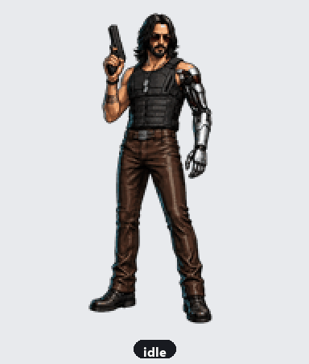

# Silverhand — DSH Desktop Pet

[](LICENSE)


<div align="center">
  
</div>

A desktop pet for the **DeepSeek Harness** Web GUI. Silverhand (a cyberpunk
mercenary with a silver cybernetic arm) lives in the bottom-right corner and
reacts to what the agent is doing — idle breathing, active work, reviewing
output, waving hello, celebrating a finished turn, sulking on an error, and
waiting for your approval.

The character artwork is migrated **as-is** from the Codex pet format — no
redesign, just the original `spritesheet.webp` + `pet.json`.

## Features

- Renders in the frame-wide `shell.overlay` layer, fixed to the bottom-right.
- Click-through by default (only the pet itself is interactive).
- Reacts to real agent state, driven by DSH host events:
  - `idle` / `running` from `agent/status`
  - `review` from `tools/result`
  - `failed` from `agent/error`
  - `waving` from `agent/created` / `agent/session-start`
  - `jumping` when a turn finishes (`running` → `idle`)
  - `waiting` while an approval request is open (`approval/request`)
- Drag the pet to move it — it walks left/right in the drag direction.
- Hover to see the current state; click (no movement) to make it jump.

## Install

This is a standard DSH plugin package. Two ways to install:

### From GitHub (recommended)

1. Add it to your profile's `dependencies` and `dsh.profile.bundles`
   (in `~/.dsh/profiles/<profile>/package.json`):

   ```json
   {
     "dependencies": {
       "silverhand-dsh-pet": "github:Qiao-NEYC/silverhand-dsh-pet"
     },
     "dsh": {
       "profile": {
         "bundles": [
           "...your existing bundles...",
           "silverhand-dsh-pet"
         ]
       }
     }
   }
   ```

2. Run `pnpm install` in the profile directory (or let the DSH desktop app
   install on launch).
3. Restart DSH. The pet appears in the bottom-right.

### From npm

Once published: `npm i silverhand-dsh-pet`, then add `"silverhand-dsh-pet"` to
`dsh.profile.bundles`.

## Layout

```
Silverhand/
├── README.md
├── LICENSE
├── .gitignore
├── package.json           # DSH plugin manifest (dsh.client, exports)
├── lib/
│   ├── index.js           # host half: reads the sprite, serves HTTP routes + state
│   └── client.js          # client half: renders the pet, polls state
├── assets/
│   ├── pet.json           # migrated Codex manifest
│   └── spritesheet.webp   # migrated sprite atlas (8×9, 192×208 cells)
├── scripts/
│   ├── make_demo_gif.py   # render docs/demo.gif (animated demo)
│   ├── analyze_frames.py  # measure per-row frame counts / diffs
│   └── contact_sheet.py   # render a labeled contact sheet
└── docs/
    ├── demo.gif           # animated demo (all animations)
    └── sprite-atlas.md    # atlas layout + state mapping
```

## Anatomy

A DSH plugin is a Cordis plugin split into two halves:

- **Host** (`lib/index.js`) runs in the DSH Node process. It reads the sprite
  from its own `assets/` (via `import.meta.url`, so it works no matter where
  the package is installed) and registers two HTTP routes:
  - `GET /silverhand-pet/spritesheet.webp` — the sprite atlas.
  - `GET /silverhand-pet/state` — `{ "state": "..." }` derived from agent events.
- **Client** (`lib/client.js`) runs in the browser. It registers into
  `shell.overlay`, polls `/silverhand-pet/state` every 300 ms, and animates the
  matching atlas row from `/silverhand-pet/spritesheet.webp`.

The two halves communicate over plain same-origin HTTP routes.

## Configuration

All tunables are constants at the top of each half:

- `lib/index.js` — `ROUTE_SPRITE` / `ROUTE_STATE`, and the per-state transient
  durations in the event listeners.
- `lib/client.js` — `ANIMS` (row / frame count / cadence per animation),
  `STATE_ANIM` (state → animation), `PET_W` / `PET_H` (display size), and the
  `CSS` block (position, shadow, hover).

## Asset provenance

The artwork was migrated from the local Codex pet directory
(`~/.codex/pets/silverhand/`). It is **your asset** — before publishing this
repo to GitHub, confirm you hold (or have) the right to redistribute the
`sprite` and the Silverhand likeness. The code in this repository is MIT
licensed; the sprite's licensing is yours to state.

## Development helpers

```bash
# Regenerate docs/demo.gif
python scripts/make_demo_gif.py

# Report per-row opaque-cell counts and consecutive-frame deltas
python scripts/analyze_frames.py

# Render a labeled contact sheet (full + zoomed ambiguous rows)
python scripts/contact_sheet.py
```

`analyze_frames.py` / `contact_sheet.py` require Python 3 with `Pillow` and
`numpy`.
